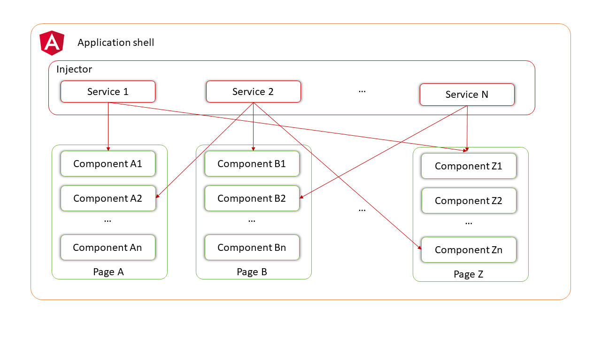
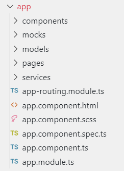

Now we want to open the file chemical-elements.service.ts. 

You can either click on this link, here: 

`devonfw/workspaces/main/devon4ng/samples/AngularMockService/src/app/services/chemical-elements.service.ts`{{open}}

and it will open the file automatically or switch to the editor and open it yourself. 

A service is an injectable logic that can be consumed by all the components that need it. It can carry manipulation functions and ,in our case, fetch data from a provider.
nside the Angular App, an Injector gives access to each component to their required services. It’s good coding practice to use a distinct service to each data type you want to manipulate. The type is described in a interface.

Let’s consider a &#39;box of data&#39; represented in JSON. Phisicly this means a folder with some JSON/TS files in it. They are located in the app/mock folder. The example uses only one mock data file. The file is typed according to our data model.

Separate your files based on purpose. In your source code, put the mock files in the mock folder, components in the components folder, services in the services folder and data models in the models folder.m

